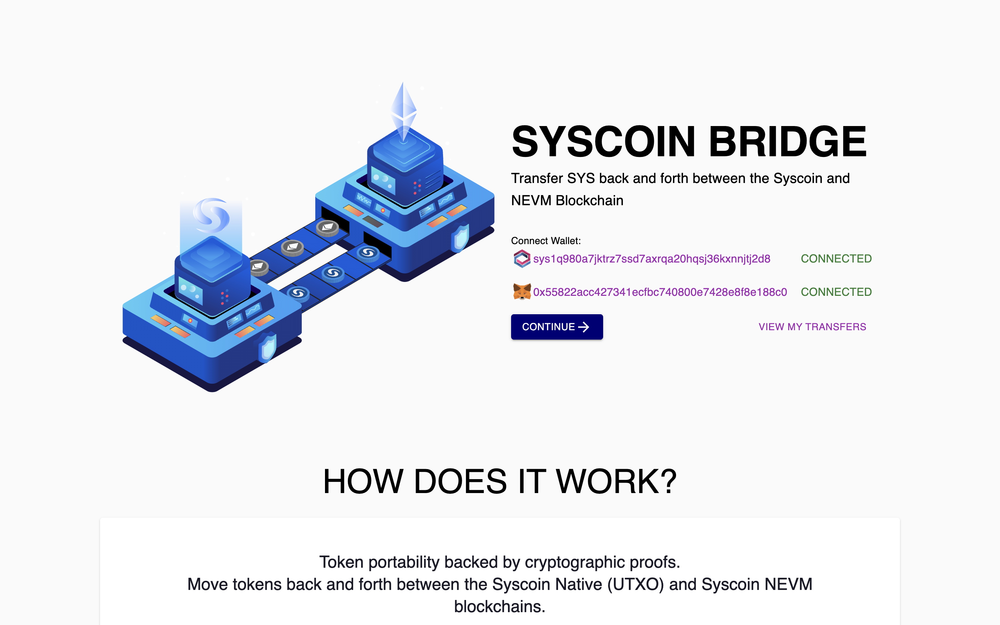
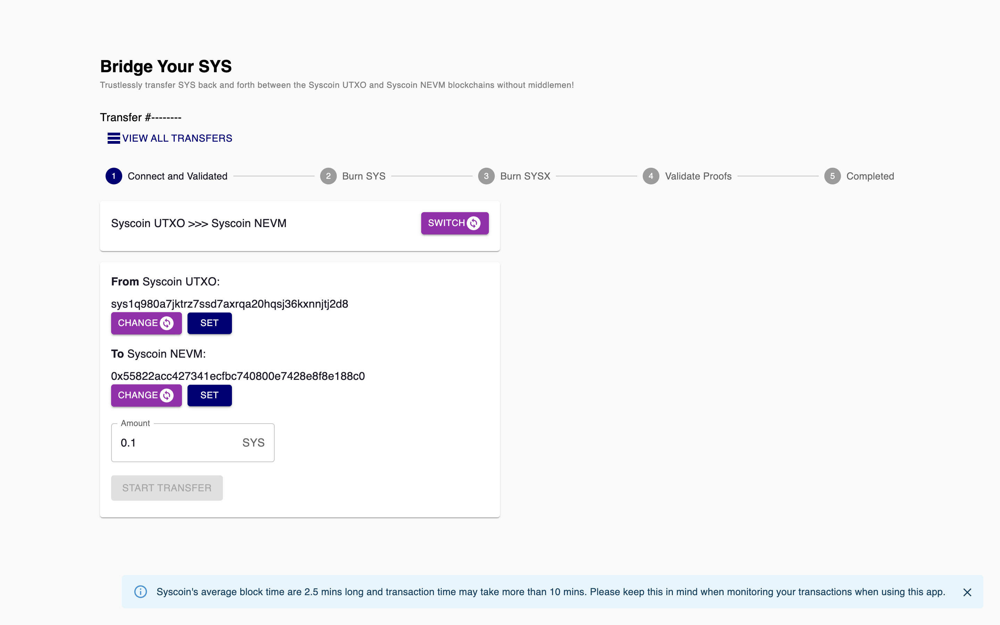
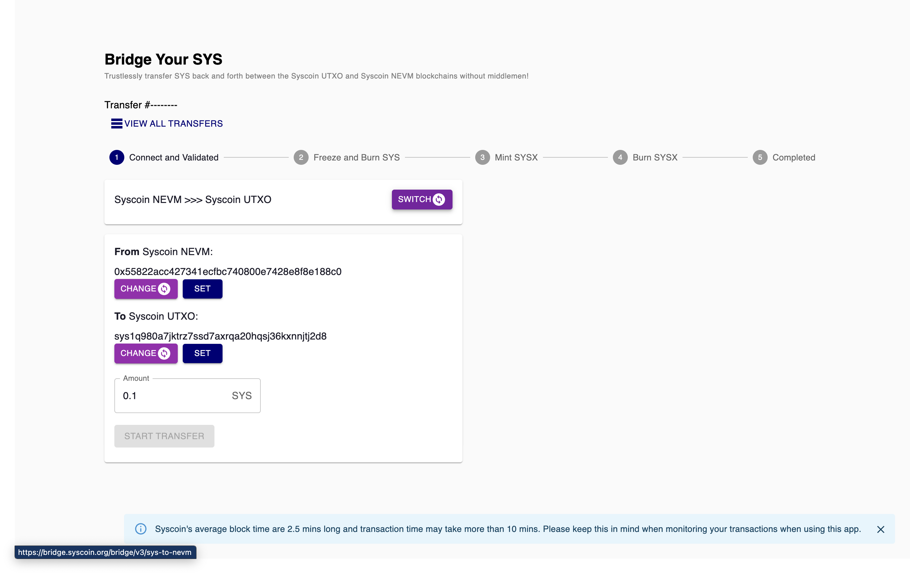

# Syscoin Bridge

This project is a bridge between Syscoin UTXO and Syscoin NEVM. It allows Syscoin assets to be moved to Syscoin NEVM and back.

https://bridge.syscoin.org/

> Trustless transfer of SYS back and forth between the Syscoin UTXO and Syscoin NEVM blockchains without middlemen !

## Screenshots





## How it works

### UTXO to NEVM

1. User burns SYS to create SYS on the Syscoin UTXO chain by via `syscoinBurnToAssetAllocation` RPC call.
2. User burns SYSX to create SYS on the Syscoin NEVM chain by via `assetAllocationBurn` RPC call and specifying the NEVM address which receives the SYS on NEVM chain.
3. Once both transactions are mined, the user can now use the transaction data to build a SPV proof `fetchBackendSPVProof` . This proof is then send to a Smart Contract on Syscoin NEVM chain.
4. The Smart Contract verifies the SPV proof and if valid, mints SYS on the Syscoin NEVM chain to the address indicated on the SPV proof.

### NEVM to UTXO

1. User freezes and Burn their SYS by calling on the `SyscoinERC20Manager` contract `freezeBurn` function.
2. Once the transaction is mined, the user can now use the transaction data to mint SYSX asset on UTXO chain by calling `assetAllocationMint` RPC call.
3. Once SYSX is minted, this again can be burned using `assetAllocationBurn` to get native SYS on UTXO.

### Bridge UI

The bridge UI is a ReactJS application that allows users to interact with the bridge. It is a NextJS application that uses Mongodb for storage. This allows users to interact with the bridge without having to install any software.

Each step taken on the Bridge is stored in MongoDB. This allows the user to resume the process at any time.

## How to run

### Prerequisites

- NodeJS 16+ (recommended to use `nvm` to install NodeJS)
- Yarn (recommended to use `npm install -g yarn` to install Yarn)

### Install dependencies

```bash
yarn install
```

### Run Dev Server

Runs NextJS Dev Server on port `3000`

```bash
yarn dev
```

## Production Deployment

### Production Build

```bash
yarn build
```

### Production Docker

```bash
docker build -t syscoin/bridge .
```

### Environment Variables (for Production Docker)

| Name                            | Description                       | Default |
| ------------------------------- | --------------------------------- | ------- |
| `MONGODB_URI`                   | MongoDB URI                       |         |
| `CONFIRM_TRANSACTION_TIMEOUTS`  | Description                       | Default |
| `MINIMUM_AMOUNT`                | Minimum amount of SYS to transfer | 100     |
| `ADMIN_API_KEY`                 | Admin API Key                     |         |
| `SECRET_COOKIE_PASSWORD`        | Secret Cookie Password            |         |
| `NEXT_PUBLIC_NEVM_RPC_URL`      | NEVM RPC URL                      |         |
| `NEXT_PUBLIC_NEVM_EXPLORER`     | NEVM Explorer URL                 |         |
| `NEXT_PUBLIC_IS_TESTNET`        | Is Testnet                        |         |
| `NEXT_PUBLIC_CHAIN_ID`          | Chain ID                          |         |
| `NEXT_PUBLIC_BLOCKBOOK_API_URL` | Blockbook API URL                 |         |

## Contact

### Developers

- [Ted](https://github.com/osiastedian)

### Channels

- [Discord](https://discord.gg/RkK2AXD)
- [Telegram](https://t.me/Syscoin_Official)
- [Twitter](https://twitter.com/syscoin)
- [Facebook](https://www.facebook.com/Syscoin/)
- [Reddit](https://www.reddit.com/r/SysCoin/)
- [LinkedIn](https://www.linkedin.com/company/syscoin/)
