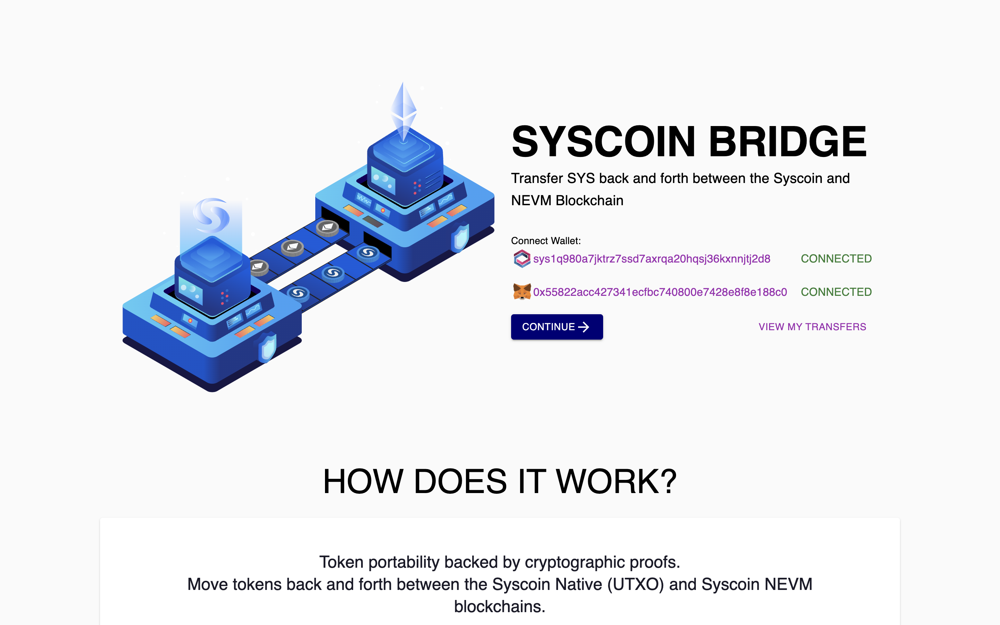
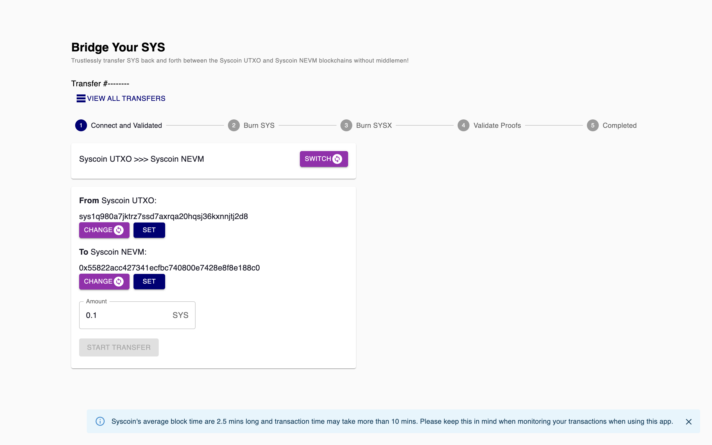
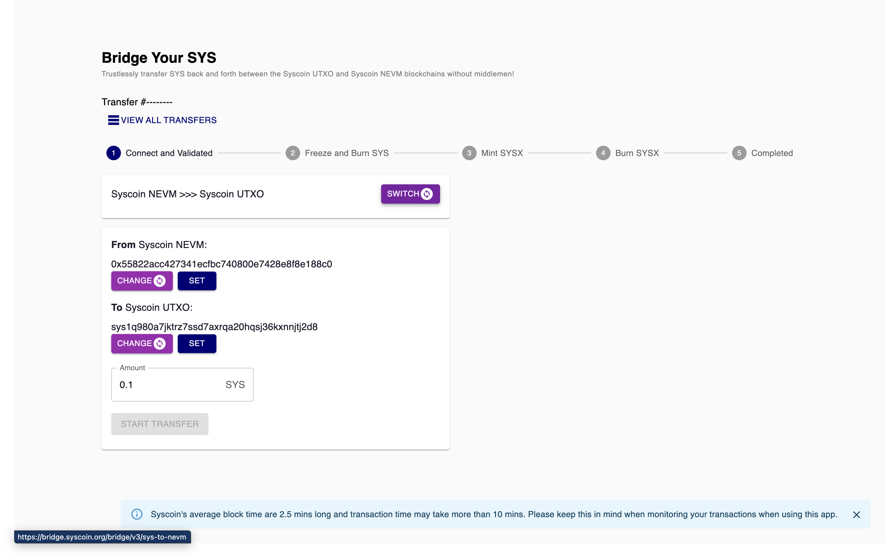

# Syscoin Bridge

This project is a bridge between Syscoin UTXO and Syscoin NEVM. It allows Syscoin assets to be moved to Syscoin NEVM and back.

https://bridge.syscoin.org/

> Trustless transfer of SYS back and forth between the Syscoin UTXO and Syscoin NEVM blockchains without middlemen !

## Screenshots





## How it works

### UTXO to NEVM

1. User burns SYS to create SYS on the Syscoin UTXO chain by via `syscoinBurnToAssetAllocation` RPC call.
2. User burns SYSX to create SYS on the Syscoin NEVM chain by via `assetAllocationBurn` RPC call and specifying the NEVM address which receives the SYS on NEVM chain.
3. Once both transactions are mined, the user can now use the transaction data to build a SPV proof `fetchBackendSPVProof` . This proof is then send to a Smart Contract on Syscoin NEVM chain.
4. The Smart Contract verifies the SPV proof and if valid, mints SYS on the Syscoin NEVM chain to the address indicated on the SPV proof.

### NEVM to UTXO

1. User freezes and Burn their SYS by calling on the `SyscoinERC20Manager` contract `freezeBurnERC20` function.
2. Once the transaction is mined, the user can now use the transaction data to mint SYSX asset on UTXO chain by calling `assetAllocationMint` RPC call.
3. Once SYSX is minted, this again can be burned using `assetAllocationBurn` to get native SYS on UTXO.

### Bridge UI

The bridge UI is a ReactJS application that allows users to interact with the bridge. It is a NextJS application that uses Mongodb for storage. This allows users to interact with the bridge without having to install any software.

Each step taken on the Bridge is stored in MongoDB. This allows the user to resume the process at any time.

### Admin access

Each deployment has a separate admin allowlist in its MongoDB database. Open
`/admin/login`, connect the registered NEVM account on the network shown by the
page, and sign the login message. The signature is free and does not submit a
transaction.

Provisioning an admin requires the deployment's `ADMIN_API_KEY`:

```bash
curl -X POST https://bridge.example/api/admin \
  -H "Authorization: Bearer $ADMIN_API_KEY" \
  -H "Content-Type: application/json" \
  --data '{"address":"0x...","name":"Admin"}'
```

Admin addresses are normalized to lowercase. Never expose `ADMIN_API_KEY` in
frontend configuration.

### Sponsored Transactions

When `FOUNDATION_FUNDED=true`, the bridge sponsors destination-side transaction fees directly. Users still sign and pay the source-chain transaction.

- `sys-to-nevm`: the configured NEVM sponsor wallet signs the final NEVM `submit-proofs` transaction, so the destination NEVM address does not need pre-existing gas to receive SYS.
- `nevm-to-sys`: the UTXO sponsor signs and broadcasts the SYSX mint. For the following SYSX-to-SYS burn, Pali signs the user-owned SYSX input and the backend signs a reserved sponsor-owned SYS fee input before broadcasting.
- `sys-to-nevm` with existing SYSX: the same split-signature UTXO flow is attempted for the SYSX burn. If the SYSX input already carries native SYS, the bridge uses the normal user-funded Pali path so native change never crosses ownership boundaries.

UTXO sponsorship reserves individual sponsor outputs by `txid:vout` in MongoDB before signing. Pre-split the UTXO sponsor wallet into multiple outputs to support concurrent users. The backend never gives a sponsor signature to the browser: it verifies the Pali-signed PSBT against the stored unsigned transaction, adds its signature last, and broadcasts atomically.

Sponsorship is idempotent per transfer/action and source transaction inputs, so refreshing or aliasing a transfer cannot repeatedly spend sponsor outputs. If the sponsor is disabled or has no available output, the UI falls back to the existing user-funded flow.

Sponsor signing keys are configured through deployment secrets/env vars. MongoDB stores sponsorship usage and UTXO reservations only; it does not store sponsor private keys.

NEVM sponsorship is server-broadcast: the backend durably stores each signed
transaction, broadcasts it in nonce order, and returns only the accepted hash
to the browser. Pending raw transactions are replayed by later requests before
another nonce is signed.

#### Foundation-funded V2 cutover

Treat enabling `FOUNDATION_FUNDED=true` as an atomic V2 backend cutover:

1. Keep funding disabled while all pre-V2/older backend instances are stopped.
2. Configure `NEVM_V2_ACTIVATION_BLOCK` to the immutable first NEVM block
   eligible for V2 sponsorship. Funding fails closed if it is missing
   or invalid.
3. Reconcile every legacy signed sponsor row that lacks `action` or
   `sourceTxHash`. Confirm/broadcast or replace its nonce as appropriate, then
   archive the row; do not copy it into the V2 sponsor namespace.
4. Reconcile duplicate historical transfer IDs. Startup checks for duplicates
   and synchronously creates the unique transfer-ID index before serving public
   writes.
5. Deploy the V2 backend and frontend together to every instance and allow its
   MongoDB indexes to be created. New transfers receive a per-transfer write
   capability; pre-cutover rows without one are intentionally read-only through
   the public API.
6. Enable foundation funding only after all instances run the same V2 sponsor
   protocol.

Startup fails closed when foundation funding is enabled while an unreconciled
legacy signed row remains. A rolling deployment with old sponsor-signing
instances is unsupported.

## How to run

### Prerequisites

- NodeJS 24+ (recommended to use `nvm` to install NodeJS)
- Yarn (recommended to use `npm install -g yarn` to install Yarn)

### Node Version Management with nvm

This project uses Node.js v24. We recommend using [nvm](https://github.com/nvm-sh/nvm) to manage Node versions:

```bash
# Install nvm (if not already installed)
curl -o- https://raw.githubusercontent.com/nvm-sh/nvm/v0.39.4/install.sh | bash

# Restart your terminal or run:
source ~/.bashrc  # or ~/.zshrc

# Install and use the correct Node version (reads from .nvmrc)
nvm install
nvm use

# Or manually install Node v24
nvm install 24
nvm use 24
```

### Install dependencies

```bash
yarn install
```

### Run Dev Server

Runs NextJS Dev Server on port `3000`

```bash
yarn dev
```

## Production Deployment

### Production Build

```bash
yarn build
```

### Production Docker

```bash
docker build -t syscoin/bridge .
```

### Environment Variables (for Production Docker)

The backend deployment treats the Compose environment files as authoritative:

- Tanenbaum: `/home/ubuntu/syscoin-bridge-testnet/.env`
- Mainnet: `/home/ubuntu/syscoin-bridge-mainnet/.env`

The deployment copies application images and Compose configuration but does not
generate, replace, or import these files from Vercel. `MONGO_ROOT_USER` and
`MONGO_ROOT_PASSWORD` initialize an empty Mongo volume only. The Docker backend
derives its internal Mongo URI from those existing credentials. The managed
Compose service explicitly ignores `MONGODB_URI` so a legacy URI with embedded
credentials cannot drift from the initialized database volume; the override
remains available to non-Compose runtimes. Never change initialized root
credentials or delete/recreate a database volume to apply an environment
change. Before validation, deployment reconciles the root settings from the
healthy running Mongo container without logging them. It also recovers the
existing data, configuration, and backup volume names from the running
containers. All three volumes are then attached as explicit external volumes,
so Compose never offers to recreate an existing Mongo data volume.

| Name                            | Description                                    | Default |
| ------------------------------- | ---------------------------------------------- | ------- |
| `MONGO_ROOT_USER`               | Existing Mongo root user used by Docker Compose and URI derivation |         |
| `MONGO_ROOT_PASSWORD`           | Existing Mongo root password used by Docker Compose and URI derivation |         |
| `MONGO_APP_DB`                  | Mongo application database                    | bridge  |
| `MONGODB_URI`                   | Optional MongoDB URI override for non-Compose runtimes; managed Compose ignores it |         |
| `MONGO_DATA_VOLUME`             | Existing external Mongo `/data/db` volume name |         |
| `MONGO_CONFIG_VOLUME`           | Existing external Mongo `/data/configdb` volume name |         |
| `MONGO_BACKUP_VOLUME`           | Existing environment-specific external Docker volume for Mongo backups |         |
| `CONFIRM_TRANSACTION_TIMEOUTS`  | Transaction confirmation timeout               |         |
| `MINIMUM_AMOUNT`                | Minimum amount of SYS to transfer              | 100     |
| `ADMIN_API_KEY`                 | Admin API Key                                  |         |
| `SECRET_COOKIE_PASSWORD`        | Secret Cookie Password                         |         |
| `ADMIN_COOKIE_DOMAIN`           | Optional domain for admin session cookie       |         |
| `NEVM_RPC_URL`                  | NEVM RPC URL                                   |         |
| `NEVM_EXPLORER`                 | NEVM Explorer URL                              |         |
| `NEVM_API_URL`                  | NEVM Block Explorer API URL (EVM only)        |         |
| `UTXO_RPC_URL`                  | UTXO RPC URL                                   |         |
| `UTXO_EXPLORER`                 | UTXO Explorer URL                              |         |
| `IS_TESTNET`                    | Is Testnet                                     |         |
| `CHAIN_ID`                      | Chain ID                                       |         |
| `RELAY_CONTRACT_ADDRESS`        | Relay contract address                         |         |
| `ERC20_MANAGER_CONTRACT_ADDRESS`| ERC20 Manager contract address                 |         |
| `SYS5_ENABLED`                  | Enable Sys5 features                           | true    |
| `PALI_V2_NEVM_ENABLED`          | Enable Pali V2 NEVM features                    | true    |
| `FOUNDATION_FUNDED`             | Enable direct NEVM and UTXO transaction fee sponsorship | false   |
| `NEVM_V2_ACTIVATION_BLOCK`      | First NEVM block eligible for V2 foundation-funded transactions; required when funding is enabled |         |
| `NEVM_SPONSOR_PRIVATE_KEY`      | Private key for the NEVM sponsor wallet used to sign sponsored `submit-proofs` transactions |         |
| `UTXO_SPONSOR_ADDRESS`          | Syscoin UTXO address used to fund sponsored mint and SYSX burn fees |         |
| `UTXO_SPONSOR_WIF`              | WIF private key for the UTXO sponsor address    |         |
| `NEXT_PUBLIC_API_BASE_URL`      | Base URL the frontend uses for API requests    |         |
| `INTERNAL_API_BASE_URL`         | Trusted backend origin used by server-side admin requests |         |
| `CORS_ALLOWED_ORIGIN`           | Allowed frontend origin(s) for API CORS responses (comma-separated, no `*` for admin cookie auth) |         |

**Note**: API URLs are only used for EVM networks. UTXO networks use Blockbook which has a different API structure.

### Split Frontend/Backend Deployments

When hosting the frontend separately from the backend services, set `NEXT_PUBLIC_API_BASE_URL` to the backend origin (for example, `https://backend.test.com`). Browser requests use that base URL when provided and otherwise remain relative to the current origin. The same variable enables a framework rewrite so hitting `/api/*` on the frontend domain proxies to the backend.

Set `INTERNAL_API_BASE_URL` to the trusted backend origin used by server-side admin requests. Use the external backend origin for split deployments and `http://127.0.0.1:3000` when the API runs in the same service. Server-side admin requests fail closed when this variable is missing and never derive their destination from request headers.

Vercel testnet previews automatically proxy `/api/*` to `https://bridge-api.tanenbaum.io` when no explicit API base is configured. The testnet backend accepts HTTPS `*.vercel.app` origins for these preview requests. Mainnet previews are never automatically connected to the production backend, and the mainnet backend continues to require an exact `CORS_ALLOWED_ORIGIN` match.

### Env Files

Next.js automatically loads `.env.local` and `.env` (and env-specific files like `.env.production`).
So a production build will pick up `.env.local` if it exists in the project root.

## Contact

### Developers

- [Ted](https://github.com/osiastedian)

### Channels

- [Discord](https://discord.gg/RkK2AXD)
- [Telegram](https://t.me/Syscoin_Official)
- [Twitter](https://twitter.com/syscoin)
- [Facebook](https://www.facebook.com/Syscoin/)
- [Reddit](https://www.reddit.com/r/SysCoin/)
- [LinkedIn](https://www.linkedin.com/company/syscoin/)
